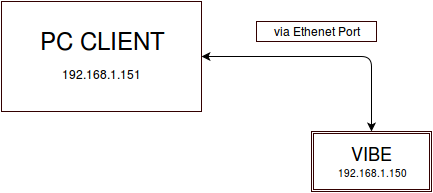

# Ethenet-Ethenet Direct Connection

- First configure your desktop client to any  IP address except 192.168.1.150 as this address is assigned to your connected VIBE by default. ( we are using 192.168.1.151 for our PC client)

- Connect VIBE to the PC client via ethernet port.

- Setup ppp0 connection. You can refer the same document under
`Setting PPP connections`

- Then you have to assign gateway IP address of your PC client as 192.168.1.150 for direct communication between client and VIBE.
- For this you have to type

         # nano /etc/network/interfaces

- A text editor will get open and then you have to configure the settings as per your requirements.( gateway IP address must be  by default. ( we are using 192.168.1.151 for our PC client)

         # wpa-ssid "essid"
         # wpa-psk  "password"

         case, to completely disable remove file [run_boot-scripts] from the b$
         iface usb0 inet static# Ethernet/RNDIS gadget (g_ether)
         # ... or on host side, usbnet and random hwaddr
         # Note on some boards, usb0 is automatically setup with an init script
         # in that# This file describes the network interfaces available on your system
         # and how to activate them. For more information, see interfaces(5).

         # The loopback network interface
         auto lo
         iface lo inet loopback

         # The primary network interface
         auto eth0
         # iface eth0 inet dhcp
         # Example to keep MAC address between reboots
         # hwaddress ether DE:AD:BE:EF:CA:FE
         iface eth0 inet static
         address 192.168.1.151
         netmask 255.255.255.0
         network 192.168.1.0
         gateway 192.168.1.150

- Now for confirmation, ping 192.168.1.150 using your PC client as well as ping 192.168.1.151( PC client) using VIBE.
- Log into VIBE via ethernet port using your PC client as root client.

#Setting PPP connections

- Place a data enabled mini-SIM in the SIM card slot and connect a GSM antenna to the respective 2G/3G antenna connector.

- Ensure that the power jumpers J2 and J3(ignore if battery feature present) on VIBE are in place and eeprom address set at 0x54 using dip switch S7.

- Power up VIBE using the 5V,5A DC adapter(supplied with VIBE).

- After powering up and bootup, ssh into VIBE through Ethernet Cable (at IP 192.168.1.150 for preflashed eMMC images)
 
           # ssh -l root 192.168.1.150

- Username for root login is root and password is root. For user login, username is debian and password is temppwd.

- Then you have to check modem using lsusb command.

`Note:` Please ensure that the user leds on the board is glowing according to its functionality after booting/powering the board.

            root@Yantrr:~# lsusb

            Bus 001 Device 002: ID 0424:2412 Standard Microsystems Corp.
            Bus 002 Device 002: ID 21f5:2012
            Bus 001 Device 001: ID 1d6b:0002 Linux Foundation 2.0 root hub
            Bus 002 Device 001: ID 1d6b:0002 Linux Foundation 2.0 root hub

- Now there are two ways to setup ppp0 connections.

a) ppp daemon

- For setting it , you have to open /etc/ppp/peers/airtel file ( we used airtel SIM).

             # nano /etc/ppp/peers/airtel

- From the opened window, you can verify the username for your service provider.

          # This option file was generated by pppconfig 2.3.18.
          #
          #
          hide-password
          noauth
          connect "/usr/sbin/chat -v -f /etc/chatscripts/airtel"
          debug
          /dev/ttyUSB3
          460800
          #defaultroute
          replacedefaultroute
          noipdefault
          user "airtel"
          remotename airtel

- Now you can use pon command.

          #  pon airtel

- You can check whether ppp0 connection is up or not.

 root@Yantrr:~# ifconfig

          eth0      Link encap:Ethernet  HWaddr 6c:ec:eb:64:98:ce
                    inet addr:192.168.1.150  Bcast:192.168.1.255  Mask:255.255.255.0
                    inet6 addr: fe80::6eec:ebff:fe64:98ce/64 Scope:Link
                    UP BROADCAST RUNNING MULTICAST  MTU:1500  Metric:1
                    RX packets:20930 errors:0 dropped:2409 overruns:0 frame:0
                    TX packets:4791 errors:0 dropped:0 overruns:0 carrier:0
                    collisions:0 txqueuelen:1000
                    RX bytes:4089157 (3.8 MiB)  TX bytes:533725 (521.2 KiB)
                    Interrupt:40

          lo        Link encap:Local Loopback
                    inet addr:127.0.0.1  Mask:255.0.0.0
                    inet6 addr: ::1/128 Scope:Host
                    UP LOOPBACK RUNNING  MTU:65536  Metric:1
                    RX packets:160 errors:0 dropped:0 overruns:0 frame:0
                    TX packets:160 errors:0 dropped:0 overruns:0 carrier:0
                    collisions:0 txqueuelen:0
                    RX bytes:14652 (14.3 KiB)  TX bytes:14652 (14.3 KiB)

          ppp0      Link encap:Point-to-Point Protocol
                    inet addr:100.105.62.223  P-t-P:10.64.64.64  Mask:255.255.255.255
                    UP POINTOPOINT RUNNING NOARP MULTICAST  MTU:1500  Metric:1
                    RX packets:7 errors:0 dropped:0 overruns:0 frame:0
                    TX packets:17 errors:0 dropped:0 overruns:0 carrier:0
                    collisions:0 txqueuelen:3
                    RX bytes:130 (130.0 B)  TX bytes:937 (937.0 B)

b) Wvdial

- First we will setup ppp0 connections using wvdial.
- For this you have to install wvdial tool using command

          # sudo apt -get install wvdial

- Now we have to set the configuration of wvdial using wvdial.conf file. For this type

          # nano /etc/wvdial.conf

- Assuming that you have the USERNAME, PASSWORD and APN available for the service provider of the SIM card being used, edit and make wvdial.conf file like this. Sample Wvdial files for some service providers are given [HERE](http://www.yantrr.com/wiki/Sample_wvdial.conf_file)

`NOTE:` Also verify the modem port mentioned in the wvdial.conf file with actual modem port.

For ZTE model- /dev/ttyUSB3

For SEW Strong Rising model- /dev/ttyUSB0

         [Dialer Defaults]
         Modem Type = Analog
         ModemPhone = *99#
         ISDN = 0
         Baud = 115200
         Username = USERNAME
         Password = PASSWORD
         Modem = /dev/ttyUSB0
         Init1 = ATZ
         Init2 = ATQ0 V1 E1 S0=0 &C1 &D2 +FCLASS=0
         Init3 = at+cgdcont=1,"ip","APN"
         Stupid Mode = 1

`Note:` Consult your network provider for exact details in case you are facing any difficulties.

Now save and exit the wvdial.conf file.

Next we have to establish wvdial connection. (In this example we have taken airtel-3G micro-SIM card)

          wvdial Airtel_3G

`NOTE:` Here you may get some errors like

        warning, can't find address for `www.suse.de`

       --> warning, address lookup does not work
       --> Nameserver (DNS) failure, the connection may not work.

- For this you have to edit your wvdial.conf file correctly by verifying the details with the service provider of your SIM card. You $

- In the following file /etc/ppp/peers/wvdial, comment or remove usepeerdns

           # nano /etc/ppp/peers/wvdial

           noauth
           name wvdial
           #usepeerdns

And in /etc/wvdial.conf ,  add following two lines in the column of your internet service provider:

          # nano /etc/wvdial.conf

          check DNS = no
          auto DNS = no

- Now we will check whether connection is established or not.

  root@Yantrr:~# ifconfig

          eth0      Link encap:Ethernet  HWaddr 6c:ec:eb:64:98:ce
                    inet addr:192.168.1.150  Bcast:192.168.1.255  Mask:255.255.255.0
                    inet6 addr: fe80::6eec:ebff:fe64:98ce/64 Scope:Link
                    UP BROADCAST RUNNING MULTICAST  MTU:1500  Metric:1
                    RX packets:20930 errors:0 dropped:2409 overruns:0 frame:0
                    TX packets:4791 errors:0 dropped:0 overruns:0 carrier:0
                    collisions:0 txqueuelen:1000
                    RX bytes:4089157 (3.8 MiB)  TX bytes:533725 (521.2 KiB)
                    Interrupt:40

          lo        Link encap:Local Loopback
                    inet addr:127.0.0.1  Mask:255.0.0.0
                    inet6 addr: ::1/128 Scope:Host
                    UP LOOPBACK RUNNING  MTU:65536  Metric:1
                    RX packets:160 errors:0 dropped:0 overruns:0 frame:0
                    TX packets:160 errors:0 dropped:0 overruns:0 carrier:0
                    collisions:0 txqueuelen:0
                    RX bytes:14652 (14.3 KiB)  TX bytes:14652 (14.3 KiB)

          ppp0      Link encap:Point-to-Point Protocol
                    inet addr:100.105.62.223  P-t-P:10.64.64.64  Mask:255.255.255.255
                    UP POINTOPOINT RUNNING NOARP MULTICAST  MTU:1500  Metric:1
                    RX packets:7 errors:0 dropped:0 overruns:0 frame:0
                    TX packets:17 errors:0 dropped:0 overruns:0 carrier:0
                    collisions:0 txqueuelen:3
                    RX bytes:130 (130.0 B)  TX bytes:937 (937.0 B)

- Here we can see three protocols

1) Ethernet (eth0)
2) Loopback (lo)
3) Point-to-Point protocol (ppp0)

- You can also check ip route :

         root@Yantrr:~# ip route
         default via 192.168.1.1 dev eth0
         10.64.64.64 dev ppp0  proto kernel  scope link  src 100.106.85.110
         192.168.1.0/24 dev eth0  proto kernel  scope link  src 192.168.1.150

- Next is to get the information about the hosts, gateways etc. For this you should view the routing table

         root@Yantrr:~# route -n
         Kernel IP routing table
         Destination     Gateway        Genmask          Flags     Metric     Ref      Use        iface
         0.0.0.0        192.168.1.1     0.0.0.0           UG        0          0       0         eth0      
         10.64.64.64    0.0.0.0         255.255.255.255   UH        0          0       0         ppp0
         192.168.1.0    0.0.0.0         255.255.255.0      U        0          0       0         eth0                                $

- Here you can see gateway is not initialised to ppp0 protocol which has an IP 10.64.64.64 and also in ip route ,it shows “default via 192.168.1.1 dev eth0” which should be changed to “default via 10.64.64.64 dev ppp0”

- For that you have to type following commands:
         # GW=$(ip address show ppp0 | awk '/peer/ {print $4}' | cut -d"/" -f1)

         # echo $GW

         # /sbin/ip route replace default via $GW dev ppp0

Now if you check routing table

          Destination     Gateway         Genmask         Flags    Metric  Ref    Use    Iface

          0.0.0.0         10.64.64.64     0.0.0.0          UG       0       0        0    ppp0

          10.64.64.64     0.0.0.0         255.255.255.255  UH       0       0        0     ppp0

          192.168.1.0     0.0.0.0         255.255.255.0    U        0       0        0     eth0

- Also the ip route command changes to

          root@Yantrr:~# ip route
          default via 10.64.64.64 dev ppp0
          10.64.64.64 dev ppp0  proto kernel  scope link  src 100.106.85.110
          192.168.1.0/24 dev eth0  proto kernel  scope link  src 192.168.1.150

- Now you are ready to use the internet connection via ppp0.

- You can check the connections by using ping command.
- Also check the file /etc/resolv.conf

        # nano /etc/resolv.conf

The content of file should be

        nameserver 192.168.1.150
        nameserver 8.8.8.8

`Note:` Another error that can arise while you ping any IP is that it may reach the DNS but could not transmit packets. For eg:

        root@Yantrr:~# ping 8.8.8.8
        PING 8.8.8.8 (8.8.8.8) 56(84) bytes of data.

        --- 8.8.8.8 ping statistics ---
        6 packets transmitted, 0 received, 100% packet loss, time 5000ms

- For this also you have to check your wvdial configurations and also the routing table.

# VIBE as an Access Point

* Connect VIBE2 to your PC client via ethernet interface.
* Check whether eth0 (ethernet connection) is up or not using the command:

          ifconfig          
                                              
          eth0      Link encap:Ethernet  HWaddr 1c:ba:8c:f1:a2:40                         
                    inet addr:192.168.1.151  Bcast:192.168.1.255  Mask:255.255.255.0      
                    inet6 addr: fe80::1eba:8cff:fef1:a240/64 Scope:Link                   
                    UP BROADCAST RUNNING MULTICAST  MTU:1500  Metric:1                    
                    RX packets:2500 errors:0 dropped:180 overruns:0 frame:0               
                    TX packets:1049 errors:0 dropped:0 overruns:0 carrier:0               
                    collisions:0 txqueuelen:1000                                          
                    RX bytes:1494880 (1.4 MiB)  TX bytes:154334 (150.7 KiB)               
                    Interrupt:40

* Now we will set our VIBE as an access point (AP).
* Before that let us understand what AP needs to be capable of to be AP:

    1. Inform devices about AP existence (Broadcast SSID) or at least allow         clients to connect.
    2. Authenticate client.
    3. Assign IP to the client devices.
    4. Route packages to the “output” network and the other way around.

* In order to handle all these,VIBE needs the following tools

    1. hostapd – Host AccessPoint Daemon 
    2. wpa-supplicant – tool responsible for WPA authorization
    3. isc-dhcp-server 
    4. ip-tables 

Let us now install these tools

        
          sudo apt-get update

          sudo apt-get -y install hostapd isc-dhcp-server iptables wpasupplicant

* Now let us set the AP configuration by creating the file /etc/hostapd/hostapd.conf and adding the following content

         interface=wlan0    #wlan0 will be working in AP mode
         ssid=Your_AP_SSID  #your AP SSID
         channel=1          #WiFi channel used by AP
         # WPA and WPA2 configuration
         macaddr_acl=0      #indicates that you do not use MAC address allow/deny list
         auth_algs=1        #indicates algorithm specified by IEEE 802.11
         ignore_broadcast_ssid=0 #AP will broadcast SSID
 
         #WPA settings
         wpa=2              #WPA algorithm used (WPA2 in this case)
         wpa_passphrase=my_secret_pass #AP password
         wpa_key_mgmt=WPA-PSK #WPA key mangement type
         wpa_pairwise=TKIP #encription algorithm
         rsn_pairwise=CCMP #encription algorithm
 
         #Hardware configuration
         driver=rtl871xdrv     #type of driver to be used (in may be different depending on your WiFi dongle chipset)
                               #in majority of cases it will be driver=nl80211
         ieee80211n=1          #Whether IEEE 802.11n (HT) is enabled 
         device_name=RTL8192CU #User-friendly description of device (optional)
         manufacturer=Realtek  #Manufacturer name (optional)
         hw_mode=g             #WPS RF Bands (a = 5G, b = 2.4G, g = 2.4G, ag = dual band)

`Note:` If you are copying the above content ,don't forget to remove the comments from the file.

* Now we need to set up /etc/hostapd/hostapd.conf as the configuration file. We do it in /etc/default/hostapd. Put the following line there:
 
         DAEMON_CONF="/etc/hostapd/hostapd.conf"

* Now let’s configure the network settings for clients connecting to AP. We do it in /etc/dhcp/dhcpd.conf

          ddns-update-style none;   #DDNS disabled
          default-lease-time 84600; #IP lease time valid for a day
          max-lease-time 84600;     #IP lease time valid for a day
          subnet 192.134.3.0 netmask 255.255.255.0 { #AP Subnet defintion
          range 192.134.3.2 192.134.3.9  ;         #Range of IP addresses available for clients
          option domain-name-servers 192.168.1.1 ; #your DNS IP (in my case, my router is workign as DNS)
          option domain-name "home";     #optional domain name
          option routers  192.134.3.1  ; #your client's gateway / router IP
          }

  
* Again we need to make sure that DHCP server uses this configuration. In /etc/default/isc-dhcp-server put the following lines:
 
         DHCPD_CONF="/etc/dhcp/dhcpd.conf"
         INTERFACES="wlan0"

* Now configure wlan0 for static IP adress (the same as router IP in dhcpd.conf file)
* We do it in /etc/network/interfaces:
 
         auto wlan0
         allow-hotplug wlan0
         iface wlan0 inet static
              address 192.134.3.1
              netmask 255.255.255.0
         up iptables-restore < /etc/iptables.ipv4.nat

* The last line will set routing rules after restart.
* Let’s turn on packet forwarding in /etc/sysctl.conf by making sure that line 
 
         net.ipv4.ip_forward=1    

is uncommented or added.

* We will configure routing now by executing (assuming eth0 is your WAN interface):

        sudo iptables -t nat -A POSTROUTING -o eth0 -j MASQUERADE

        sudo iptables -A FORWARD -i eth0 -o wlan0 -m state --state RELATED,ESTABLISHED -j ACCEPT

        sudo iptables -A FORWARD -i wlan0 -o eth0 -j ACCEPT 

and lets save these setting in a file:
 
        sh -c "iptables-save > /etc/iptables.ipv4.nat"

* If you are using RTL8188CUS chipset you had to replace original hostapd with the one prepared for this chipset. 
         
        wget "http://raspberry-at-home.com/files/hostapd.gz"
        sudo gzip -d hostapd.gz
        sudo chmod 755 hostapd
        sudo cp hostapd /usr/sbin/

